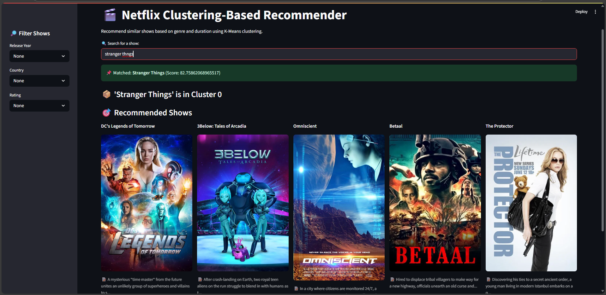

# 🎬 FlixRecommender  
### *Netflix Clustering-Based Recommender System*

An interactive **Streamlit** app that clusters and recommends Netflix shows using **unsupervised machine learning**. It applies **K-Means clustering** on **genres** and **duration**, supports **search with fuzzy matching**, and integrates **poster images and trailers** via the **TMDB API**.

---

## 📸 Preview

  

---

## 🚀 Features

- 🔍 **Smart Search** with fuzzy matching using `rapidfuzz`
- 🎯 **K-Means Clustering** based on show genres and duration
- 🤖 **Intelligent Recommendations** of similar shows from the same cluster
- 📸 **Live Show Posters** from TMDB API
- 🎞️ **Trailers & Full Descriptions** fetched dynamically
- 🧪 **PCA Scatter Plot** to visualize cluster distribution
- 🎛️ **Advanced Filters**: Filter by rating, country, or release year

---

## 🚀 Live Deploed Model

👉 [s.app]()

---

## 📁 Project Structure

```
trahulsingh-flixrecommender/
├── app.py                  # 🎯 Main Streamlit app
├── requirements.txt        # 📦 All required Python dependencies
├── README.md               # 📘 This file
├── LICENSE                 # 📄 MIT License
├── .env                    # 🔐 API keys (e.g., TMDB_API_KEY)
├── wholecode.ipynb         # 📓 (Optional) Jupyter version
└── data/
    └── netflix_titles.csv  # 📄 Dataset from Kaggle
```

---

## 📦 Installation

1. **Clone the repository**  
```bash
git clone https://github.com/TRahulsingh/trahulsingh-flixrecommender.git
cd trahulsingh-flixrecommender
```

2. **Install dependencies**
```bash
pip install -r requirements.txt
```

3. **Configure TMDB API key**  
Create a `.env` file in the root directory:

```
TMDB_API_KEY=your_tmdb_api_key_here
```

Get your API key from: [TMDB API](https://www.themoviedb.org/documentation/api)

4. **Run the Streamlit app**
```bash
streamlit run app.py
```

---

## 📈 Dataset

This app uses the public Netflix Movies and TV Shows dataset from Kaggle:  
📥 https://www.kaggle.com/datasets/shivamb/netflix-shows

The dataset includes:
- 🎬 Title
- 📅 Release year
- 🕒 Duration
- 🌍 Country
- 🔞 Rating
- 🎭 Listed genres
- 📝 Description

---

## 🛠 Built With

- Python 🐍  
- Streamlit ⚡  
- Scikit-learn – KMeans, PCA  
- RapidFuzz – for fuzzy title matching  
- Pandas & NumPy – data handling  
- Matplotlib & Seaborn – data visualization  
- TMDB API – for posters, metadata, and trailers  
- dotenv – to securely manage API keys  

---

## 🧠 Future Improvements

- 🔒 User login and personal watchlists  
- 📊 Add content-based or collaborative filtering  
- 📂 Deploy as a hosted web app (Streamlit Cloud or Hugging Face Spaces)  

---

## 🧑‍💻 Author

Made with ❤️ by **TRahulsingh**  
GitHub: [@TRahulsingh](https://github.com/TRahulsingh)  

---

## 📄 License

This project is licensed under the MIT License. See the LICENSE file for details.  
Feel free to fork, modify, and share!
